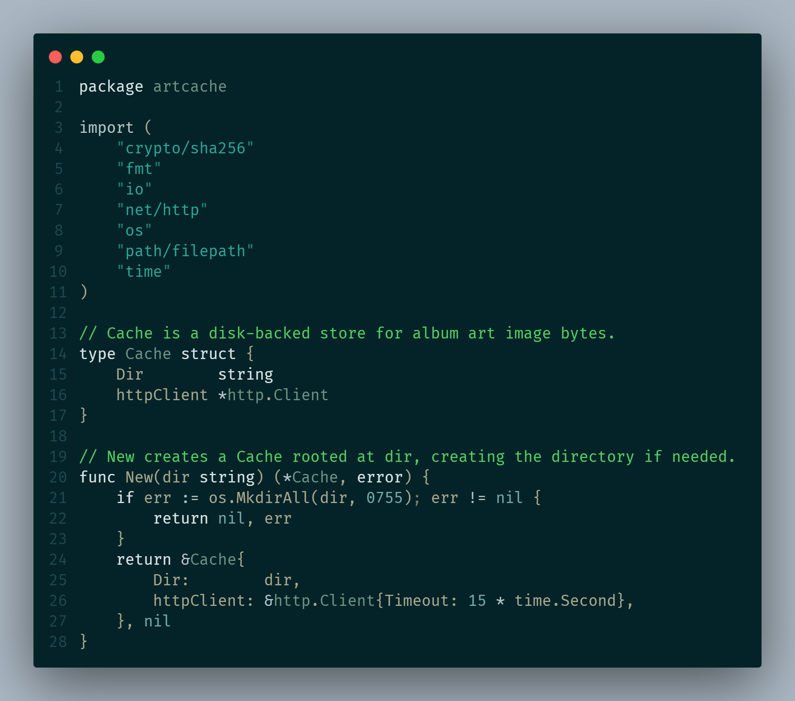

# Seafloor Dark

A dark teal VSCode theme.

## Preview

## Installation

Install from the [VS Code Marketplace](https://marketplace.visualstudio.com/items?itemName=timdestan.seafloor-dark), or search for **Seafloor Dark** in the Extensions panel (`Ctrl+Shift+X`).

Once installed, select the theme via `Ctrl+K Ctrl+T`.
